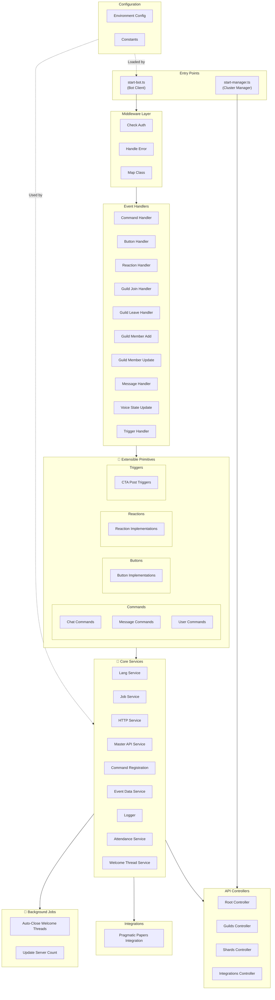

# Digital Ground Game Discord Bot - Architecture Overview

## System Architecture

## Component Descriptions

### Entry Points

- **[start-bot.ts](../src/start-bot.ts)**: Main Discord bot client that handles real-time events
- **[start-manager.ts](../src/start-manager.ts)**: Cluster manager for scaling and coordinating multiple bot instances

### Middleware Layer

Processing pipeline for all requests:

- **Check Auth**: Authentication and authorization validation
- **Handle Error**: Centralized error handling and logging
- **Map Class**: Request/response mapping and serialization

### 🔧 Extensible Primitives

The bot template provides several base classes/interfaces to make extending functionality easier:

#### **Commands** (Extends: `Command`)

Slash commands, message commands, and user context menu commands.

**How to extend**: Create a new file in `src/commands/{category}/` implementing the `Command` interface with `data` and `execute()` method. Register automatically via Command Registration Service.

**Current implementations**: Chat, Message, and User commands

**Paths:** [`src/commands/chat`](../src/commands/chat/), [`src/commands/message`](../src/commands/message/), [`src/commands/user`](../src/commands/user/)

#### **Buttons** (Extends: `Button`)

Interactive button handlers for custom ID-based interactions.

**How to extend**: Create a new file in [`src/buttons/`](../src/buttons/) with custom Button logic. Subscribe to button interactions via Button Handler.

#### **Reactions** (Extends: `Reaction`)

Emoji reaction handlers for custom message interactions.

**How to extend**: Create a new file in [`src/reactions/`](../src/reactions/) with custom Reaction logic. Link to triggers or messages.

#### **Triggers** (Extends: `Trigger`)

Event-based triggers for custom bot behaviors (e.g., CTA post detection).

**How to extend**: Create a new file in [`src/triggers/`](../src/triggers/) implementing the `Trigger` interface. Register in Trigger Handler.

#### **Event Handlers** (Extends: `EventHandler`)

Handlers for Discord.js events with custom business logic.

**How to extend**: Create a new file in `src/events/` implementing the `EventHandler` interface. Register in main bot event system.

#### **Services** (Extends: `Service`)

Singleton business logic and utility services shared across the bot.

**How to extend**: Create a new file in `src/services/` implementing the `Service` interface. Services are instantiated once and injected into handlers/commands that need them.

**Current services**: Lang (i18n), HTTP, Logging, Master API, Command Registration, Event Data, Attendance, Welcome Threads

#### **Jobs** (Extends: `Job`)

Background scheduled tasks that run periodically.

**How to extend**: Create a new file in `src/jobs/` implementing the `Job` interface with `name` and `execute()` method. Managed by Job Service.

**Current jobs**: Auto-close welcome threads, Update server count

#### **Integrations** (Extends: `Integration`)

External service integrations with plugin architecture.

**How to extend**: Create a new file in `src/integrations/` implementing the `Integration` interface. Currently supports Pragmatic Papers integration.

### Event Handlers

Discord event routing layer. Each handler processes a specific event type:

- **Command Handler**: Routes slash/message/user commands to Command implementations
- **Button Handler**: Routes button interactions to Button implementations
- **Reaction Handler**: Routes reaction events to Reaction implementations
- **Guild Handlers**: Manages guild join/leave, member add/update, voice state changes
- **Message Handler**: Processes messages
- **Trigger Handler**: Evaluates and executes Triggers

### Controllers

API layer for cluster management and cross-shard coordination:

- **[Root Controller](../src/controllers/root-controller.ts)**: Base API controller
- **[Guilds Controller](../src/controllers/guilds-controller.ts)**: Guild-related API endpoints
- **[Shards Controller](../src/controllers/shards-controller.ts)**: Shard/cluster status and management
- **[Integrations Controller](../src/controllers/integrations-controller.ts)**: Integration-related endpoints

### Configuration

- **[Environment Config](../src/config/environment.ts)**: Loads and validates environment variables
- **[Constants](../src/constants/index.ts)**: Discord limits, server roles, rules, onboarding flow definitions

## Data Flow

1. **Discord Event** → Bot receives Discord.js event
2. **Middleware** → Request passes through Auth, Error handling, and mapping
3. **Event Handler** → Routes event to appropriate handler (Command, Button, Reaction, etc.)
4. **Primitive** → Specific Command/Button/Trigger/etc. executes business logic
5. **Services** → Access shared utilities (Lang, HTTP, API, Logging, etc.)
6. **Response** → Result sent back to Discord or stored via services

## Key Relationships

- **Event Handlers** bridge Discord events to Primitives
- **Primitives** implement the extensible template pattern—the most common place for new bot functionality
- **Services** provide cross-cutting concerns (logging, HTTP, data access) to any Primitive
- **Jobs** run independently on a schedule, using Services for their logic
- **Integrations** are plugins that extend bot capabilities (Pragmatic Papers)
- **Controllers** expose bot state and management via API
- **Middleware** provides consistent request/response handling across all entry points
