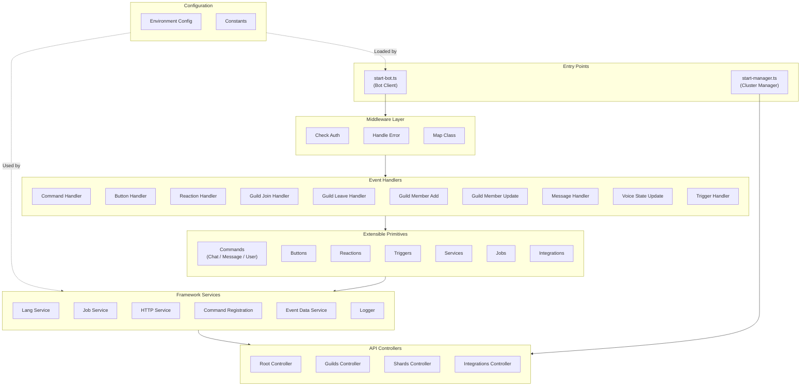
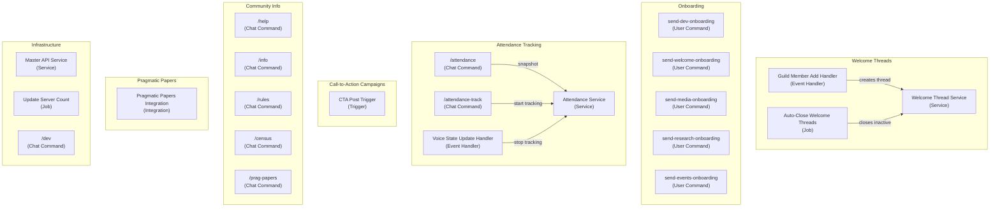

# Digital Ground Game Discord Bot - Architecture Overview

## Bot Template Architecture

The following diagram shows the generic framework that any bot built on this template would have. DGG-specific implementations plug into the **Extensible Primitives** (Commands, Services, Jobs, etc.).

## DGG Feature Map

The following diagram shows all DGG-specific components organized by feature. Each node is labeled with the template primitive type it implements.

## Component Descriptions

### Template Framework

#### Entry Points

- **[start-bot.ts](../src/start-bot.ts)**: Main Discord bot client that handles real-time events
- **[start-manager.ts](../src/start-manager.ts)**: Cluster manager for scaling and coordinating multiple bot instances

#### Middleware Layer

Processing pipeline for all requests:

- **Check Auth**: Authentication and authorization validation
- **Handle Error**: Centralized error handling and logging
- **Map Class**: Request/response mapping and serialization

#### Extensible Primitives

The bot template provides several base classes/interfaces to make extending functionality easier:

**Commands** (Extends: `Command`) — Slash commands, message commands, and user context menu commands. Create a new file in `src/commands/{category}/` implementing the `Command` interface. Paths: [`src/commands/chat`](../src/commands/chat/), [`src/commands/message`](../src/commands/message/), [`src/commands/user`](../src/commands/user/)

**Buttons** (Extends: `Button`) — Interactive button handlers for custom ID-based interactions. Create a new file in [`src/buttons/`](../src/buttons/).

**Reactions** (Extends: `Reaction`) — Emoji reaction handlers. Create a new file in [`src/reactions/`](../src/reactions/).

**Triggers** (Extends: `Trigger`) — Event-based triggers for custom bot behaviors. Create a new file in [`src/triggers/`](../src/triggers/).

**Services** (Extends: `Service`) — Singleton business logic shared across the bot. Create a new file in `src/services/`. Services are instantiated once and injected into handlers/commands that need them.

**Jobs** (Extends: `Job`) — Background scheduled tasks that run periodically. Create a new file in `src/jobs/` implementing the `Job` interface with `name` and `execute()`.

**Integrations** (Extends: `Integration`) — External service integrations with plugin architecture. Create a new file in `src/integrations/`.

#### Event Handlers

Discord event routing layer. Each handler processes a specific event type:

- **Command Handler**: Routes slash/message/user commands to Command implementations
- **Button Handler**: Routes button interactions to Button implementations
- **Reaction Handler**: Routes reaction events to Reaction implementations
- **Guild Handlers**: Manages guild join/leave, member add/update, voice state changes
- **Message Handler**: Processes messages
- **Trigger Handler**: Evaluates and executes Triggers

#### Framework Services

Shared utilities available to all primitives:

- **Lang Service**: i18n service for language strings
- **Job Service**: Manages scheduled jobs (CRON)
- **HTTP Service**: HTTP client wrapper
- **Command Registration**: Registers commands with the Discord API
- **Event Data Service**: Creates `EventData` objects for handlers; resolves guild preferred locale
- **Logger**: Structured logging

#### API Controllers

API layer for cluster management and cross-shard coordination:

- **[Root Controller](../src/controllers/root-controller.ts)**: Base API controller
- **[Guilds Controller](../src/controllers/guilds-controller.ts)**: Guild-related API endpoints
- **[Shards Controller](../src/controllers/shards-controller.ts)**: Shard/cluster status and management
- **[Integrations Controller](../src/controllers/integrations-controller.ts)**: Integration-related endpoints

#### Configuration

- **[Environment Config](../src/config/environment.ts)**: Loads and validates environment variables
- **[Constants](../src/constants/index.ts)**: Discord limits, server roles, rules, onboarding flow definitions

---

### DGG Features

#### Welcome Threads

Components that manage the welcome thread lifecycle for new members.

- **[Guild Member Add Handler](../src/events/guild-member-add-handler.ts)**: On member join, calls Welcome Thread Service to create a private thread visible only to the new member and the welcome team
- **[Welcome Thread Service](../src/services/welcome-thread-service.ts)**: Creates and manages welcome threads; handles visibility restrictions by role
- **[Auto-Close Welcome Threads Job](../src/jobs/auto-close-welcome-threads-job.ts)**: Runs on a configurable schedule; sends a warning DM and then closes threads that have been inactive for more than N days (default: 5)

#### Onboarding

User context menu commands that let coordinators send team-specific onboarding DMs to a selected member. All five commands are generated from `ONBOARDING_CONFIGS` in [`src/constants/onboarding.ts`](../src/constants/onboarding.ts).

- **[send-dev-onboarding](../src/commands/user/send-onboarding.ts)**: Sends Dev team onboarding DM
- **[send-welcome-onboarding](../src/commands/user/send-onboarding.ts)**: Sends Welcome team onboarding DM
- **[send-media-onboarding](../src/commands/user/send-onboarding.ts)**: Sends Media team onboarding DM
- **[send-research-onboarding](../src/commands/user/send-onboarding.ts)**: Sends Research team onboarding DM
- **[send-events-onboarding](../src/commands/user/send-onboarding.ts)**: Sends Events team onboarding DM

#### Attendance Tracking

Components for capturing who attended a voice channel session.

- **[/attendance](../src/commands/chat/attendance-command.ts)**: Snapshot command — DMs the caller a list of current VC members at the time of invocation
- **[/attendance-track](../src/commands/chat/attendance-track-command.ts)**: Tracking command — starts accumulating a list of all members who joined the VC; sends the full list when the caller leaves
- **[Attendance Service](../src/services/attendance-service.ts)**: Maintains active tracking sessions; handles join/leave events; delivers final DM on session end
- **[Voice State Update Handler](../src/events/voice-state-update-handler.ts)**: Fires when any user's voice state changes; notifies Attendance Service to stop tracking when the session owner leaves

#### Call-to-Action Campaigns

- **[CTA Post Trigger](../src/triggers/cta-post.ts)**: Monitors the `call-to-action` announcement channel; on a new CTA post it creates a thread with live region response charts and tracks region role reactions over a one-hour window

#### Community Info

General-purpose informational commands.

- **[/help](../src/commands/chat/help-command.ts)**: Displays help options (contact support, view commands)
- **[/info](../src/commands/chat/info-command.ts)**: Displays server info (about, translators)
- **[/rules](../src/commands/chat/rules-command.ts)**: Displays server rules; accepts an optional rule number to query a single rule
- **[/census](../src/commands/chat/census-command.ts)**: Displays census/demographic info embed
- **[/prag-papers](../src/commands/chat/prag-papers-command.ts)**: Displays Pragmatic Papers project info

#### Pragmatic Papers

- **[Pragmatic Papers Integration](../src/integrations/pragmatic-papers-integration.ts)**: Webhook receiver listening at `/pp-event`; on a publish event, posts the new article to the designated Discord channel

#### Infrastructure

- **[Master API Service](../src/services/master-api-service.ts)**: Communicates with the master cluster API for shard registration, login, and ready-status coordination
- **[Update Server Count Job](../src/jobs/update-server-count-job.ts)**: Updates bot presence and posts server count to bot listing sites on a configurable schedule
- **[/dev](../src/commands/chat/dev-command.ts)**: Dev-only command that surfaces shard info, memory usage, and server count; restricted by role

---

## Data Flow

1. **Discord Event** → Bot receives Discord.js event
2. **Middleware** → Request passes through Auth, Error handling, and mapping
3. **Event Handler** → Routes event to appropriate handler (Command, Button, Reaction, etc.)
4. **Primitive** → Specific Command/Button/Trigger/etc. executes business logic
5. **Services** → Access shared utilities (Lang, HTTP, API, Logging, etc.)
6. **Response** → Result sent back to Discord or stored via services

## Key Relationships

- **Event Handlers** bridge Discord events to Primitives
- **Primitives** implement the extensible template pattern — the most common place for new bot functionality
- **Framework Services** provide cross-cutting concerns (logging, HTTP, data access) to any Primitive
- **Jobs** run independently on a schedule, using Services for their logic
- **Integrations** are plugins that extend bot capabilities (Pragmatic Papers)
- **Controllers** expose bot state and management via API
- **Middleware** provides consistent request/response handling across all entry points
